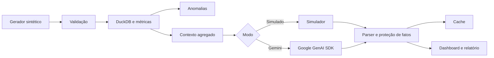

# Arquitetura

```mermaid
flowchart LR
  A[Gerador sintético] --> B[Validação]
  B --> C[DuckDB e métricas]
  C --> D[Anomalias]
  C --> E[Contexto agregado]
  E --> F{Modo}
  F -->|Simulado| G[Simulador]
  F -->|Gemini| H[Google GenAI SDK]
  G --> I[Parser e proteção de fatos]
  H --> I
  I --> J[Cache]
  I --> K[Dashboard e relatório]
```
